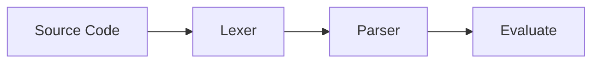
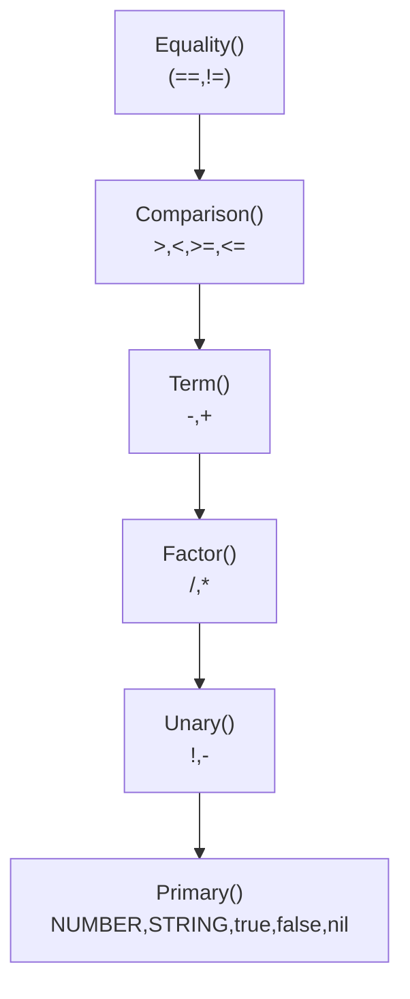

## Zoo Programming Language
<a align="center">
 
</a>
* Zoo is an experimental interpreted programming language I am building for educational purposes
## Language Structure


## The Parser
* The parser uses `the recursive descent` technique 
* each grammar rule becomes a parsing methods.

* This structure allows for the implicit handling of operator precedence, from highest to lowest.
## Grammaticals rules
* You will find the various rules of the language below.
```text
  programm-> declaration* EOF

  declaration -> statement|var_declaration

  var_declaration -> "var" IDENTIFIER ("=" expression)? ";" ;

  -------------------------------------------------------------------------->

  statement      → exprStmt 
               | ifStmt
               | printStmt
               | whileStmt
               | blockStmt ;

  --------------------------------------------------------------------------->

  exprStmt -> expression ";" ;

  ifStmt  ->  "if" "(" expression ")" statement ("else" statement)?;

  printStmt -> "print" expression  ;

  whileStmt -> "while" "(" expression ")"  statement ;

  blockStmt-> "{"declaration*"}"

  ----------------------------------------------------------------------------->

  expression    -> asign;

  asign -> IDENTIFIER  "=" asign | Or_LG;

  Or_LG  -> AND_LG ("or" AND_LG);

  AND_LG -> equality ("and" equality)*;

  equality       → comparison ( ( "!=" | "==" ) comparison )* ;

  comparison     → term ( ( ">" | ">=" | "<" | "<=" ) term )* ;

  term           → factor ( ( "-" | "+" ) factor )* ;

  factor         → unary ( ( "/" | "*" ) unary )* ;

  unary          → ( "!" | "-" ) unary | primary ;

  primary        → NUMBER | STRING | "true" | "false" | "nil";
               | "(" expression ")" ;

```

## Language exemple 
* It is a dynamically typed language, inspired by the syntax of the C language.
```text
var somme=0;
var n=4;
for (var i =0;i<=n;i=i+1){
     somme=somme+i;
}
print somme ;


```


